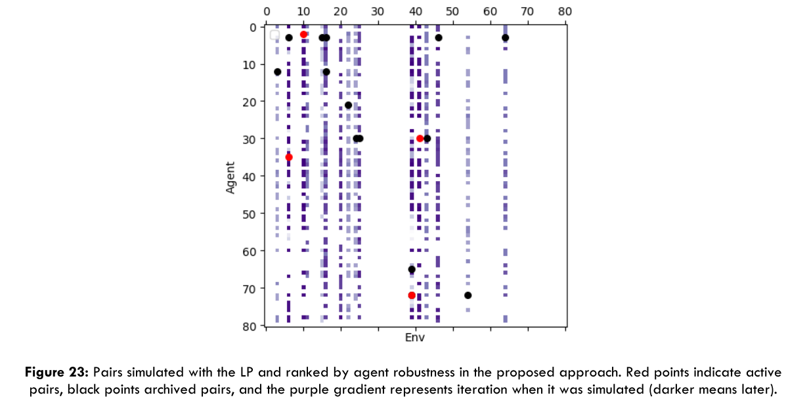
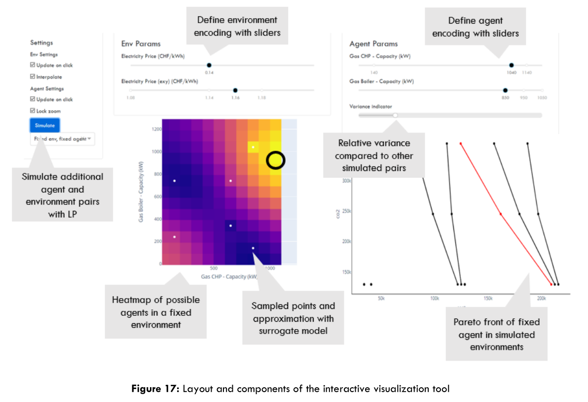

# POETforMES

Master's Thesis for the M.Sc. of Integrated Building Systems at ETH Zürich, 29.03.2021.

**Navigating Uncertainty with Co-Evolution of Agents and Environments for the Design of Robust Multi-Energy Systems**

## Abstract

Distributed Multi-Energy Systems (DMES) are often designed deterministically, although research suggests that uncertainty can cause significant deviations in performance of DMES and should therefore be considered in design selection. State of the art approaches propose a framework of assessing and quantifying sensitivity of uncertain parameters in DMES design and offer approaches to optimize these designs under uncertainty. However, they are often first optimized for a single scenario first, which can theoretically miss robust designs that are not necessarily optimal in any single scenario. The goal of this thesis is to see if an approach based on the Paired-Open Ended Trailblazer (POET) algorithm can find these designs and help planners more confidently select robust DMES design.

POET coevolves agents (designs) and their environments (scenarios) in which they are optimized, by encouraging novelty, optimizing agents locally in an environment and allowing transfers of high performing agents into other environments. This thesis aims to apply this approach for finding robust DMES designs with several modifications: discretized mutations for comparisons and robustness calculations, an elitist local optimizer, and a linear program (LP) that aims to minimize the cost of a solution.

The results confirm that the state of the approach does miss robust designs that are found by the modified POET within comparable computational time. However, the accuracy of robustness scores suffers for the proposed methodology and is not as systematic in its investigation of agents’ robustness as the current research. The proposed methodology is therefore recommended at an early stage to broadly view uncertainty whilst current approaches are more suitable for a thorough assessment of robustness.

Finally, an interactive visualization tool is developed that allows for environment and agent comparison. The tool consists of a heatmap grid to compare agents in other environment, with sampled points and an approximation via surrogate model of the entire performance space. A comparative pareto front graph allows to compare a single agent’s performance relative to the objectives in different environments. The tool was found to provide a good overview and quick response time for planners, which can encourage planners to explore uncertainty in their designs at an early stage.

## Key Figures

### Simulation Example

### Visualiser

## Demo

## Links

[POET Algorithm](https://eng.uber.com/poet-open-ended-deep-learning/)

## Code

Backend: Python

Frontend: Dash (Plotly)

Upload TBD.
